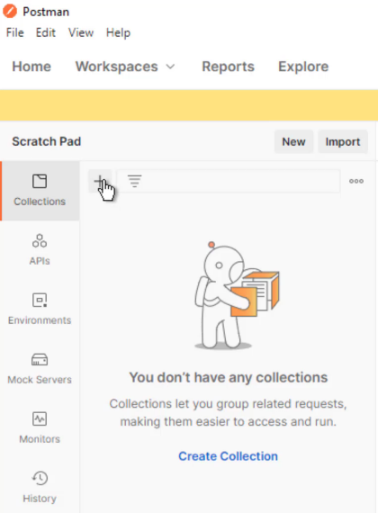
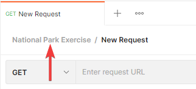

# Week 6 Review: National Park Service API

In this exercise, you have the opportunity to use two public APIs. One is from the National Park Service (NPS) that provides data and content about their parks, campgrounds, visitor centers, tours, and more. The other gives you a set of challenges that you must use the National Park Service API to answer, as well as giving you an endpoint to submit your answers to see if you're correct.

The goal of this exercise is to give you more experience using Postman and reading API documentation. There is no starting code for this exercise.

## Getting started

Before using the National Park Service API, you need to sign up for an **API key**. An API key is a unique identifier used to authenticate a user or application with an API. The NPS provides API keys free of charge—go to https://www.nps.gov/subjects/developer/get-started.htm and fill the form to receive your key. It's best if each student in your group fills out the form and receives their own API key.

> Note: it's best practice is to keep API keys secret. While it's not the end of the world if someone gets your NPS API key, other APIs may provide sensitive information or charge you for each request. The worst thing that can happen with the NPS API key getting out is that you can't make requests for a period of time.

You need to provide the API key with every request. The NPS API can accept the key in three different ways as shown in their documentation: https://www.nps.gov/subjects/developer/guides.htm. The [Postman](#postman) section later in this README walks you through on setting up the API key in an HTTP header that's sent with every request.

### Exercise API

The base URL for the exercise API is `https://teapi.netlify.app/api/national-park-exercise`. You'll append one of the following endpoints to the base URL to make a request:

* `/challenges`: responds to a `GET` request and returns the challenges for this exercise in JSON format.
    * You can also append an ID to get the data for a single challenge—for example, `/challenges/1` returns the data for Challenge 1.
* `/verify/{id}`: responds to a `POST` request containing a request body with the answer for the challenge. You must have the ID of the challenge your answering in the URL—for example, `/verify/1`. You'll receive a response that indicates if the answer is correct or not.

#### Challenge data format

The `/challenges` endpoint returns data in the following format:

```json
{
    "id": "1", // the challenge number, you need this ID to submit your answer
    "question": "How many parks does the National Parks API provide data on?", // the question you need to answer
    "hint": "Use /parks to retrieve data about national parks.", // a clue on how to look up the information and the endpoint to use
    "answer": "" // the format of your answer, is either a single empty string or an object with multiple fields, see the next section for more information
}
```

#### Verify data format

The `/verify` endpoint expects a JSON object with two fields—`apiKey` and `answer`.

The `apiKey` field is your National Park Service API key. The exercise API uses your NPS API key to make a request to the NPS API to verify the answer. If you don't provide a key or your key is invalid, you'll receive an error from the exercise API.

The `answer` field from the `/challenges` endpoint indicates the format of the answer. It's either a single string—`"answer": ""`—or an object to tell you the expected fields like:

```json
{
    "answer": {
        "latitude": "",
        "longitude": ""
    }
}
```

For challenges you answer with a single value, your request looks something like:

```json
{
    "apiKey": "1a2b3c4d5e6f7g8h9i0j1k2l3m4n5o6p7q8r9s0t", // your NPS API key
    "answer": "23"
}
```

For challenges you answer with multiple values, your request looks something like:

```json
{
    "apiKey": "1a2b3c4d5e6f7g8h9i0j1k2l3m4n5o6p7q8r9s0t", // your NPS API key
    "answer": {
        "latitude": "44.409286",
        "longitude": "-68.247501"
    }
}
```

> Note: some challenges ask for numeric values, but your answer must be in a string like you see in the preceding examples and the NPS API.

You may find it easier to copy the relevant fields and data from the NPS API and paste into your `POST` request to the exercise API. Only one challenge has a field that's not in the API dataset—you just count the number of something instead.

#### Verify endpoint response

You'll receive one of several possible responses from the `/verify` endpoint based on the data you submitted.

| Response code | Message                                     | What this means |
| ------------- | ------------------------------------------- | --------------- |
| 200           | "Correct!"                                  | You submitted the correct data and a valid API key. |
| 400           | "Incorrect data for answer."                | Your request was successful but had the wrong data. For object requests, this also lets you know which field is wrong. |
| 400           | "Invalid request payload."                  | A field in your request wasn't supplied or in the correct format. This also lets you know if you're missing a field in an object request. |
| 403           | "Invalid API key."                          | You didn't provide a value for `apiKey` or it wasn't complete. |
| 429           | "Your API key has exceeded the rate limit." | The NPS API has a limit of 1,000 requests per hour. It may be unlikely that you'll hit this, but it's good to be aware of it. |

### National Park Service API

The National Park Service provides online documentation of their API at https://www.nps.gov/subjects/developer/api-documentation.htm. They offer several endpoints that provide different datasets. You're not expected to read the entire contents of the documentation, but it's a good idea to look at the documentation for each endpoint as you use it. The challenge problems tell you which endpoint you need to answer it.

The documentation for each endpoint contains a brief description of what it provides. If you click the blue bar, it expands to show the parameters that you can use to narrow the results by park, state, or those that match a search term.

Following the parameters is an example of the data you can expect from the endpoint. To view the data fields without examples, you can click the small blue link that reads **Model**, or go to the section titled **Models** at bottom of the documentation page. For each endpoint, the NPS provides the format of the data and descriptions of most fields.

## Postman

You'll use Postman in this exercise to make requests to both APIs. Postman offers many features that make interacting with APIs easier. One such feature is a **Collection** which is a way to group similar requests. A collection also allows you to set the same authorization method for all requests in the collection.

To create a new collection, click the **Collections** button on the sidebar in Postman, and then click the **+** button:



After you create the new collection, give it a meaningful name like _National Park Exercise_:


On the same screen you can set the authorization method and provide your NPS API token. First, change the **Type** drop-down to **API Key**. A section appears following the drop-down. In the **Key** textbox type "X-Api-Key" (without the quotes) and in the **Value** textbox copy and paste your NPS API key. Leave the **Add to** drop-down on **Header**:


You can now begin adding requests to the collection that uses the same authorization. In the **Collections** view on the side find the new collection you just created. Click the three dots **○○○** and select **Add Request**:


Do this for all requests that you send to the National Park Service API and it automatically sends your API key with it. If you get a response from the API that your API key isn't valid, make sure your request is under the collection you created:



The [Using Postman for HTTP GET video](https://lms.techelevator.com/content_link/gitlab.com/te-curriculum/intro-to-tools-lms/postman/03-making-GET-request.md) in the _Intro to Tools: Postman_ unit also gives a demonstration of creating a new collection and making `GET` requests.

> Note: Even though you set the API Key in the Authorization tab, you must still send it in the request body to the Exercise API for validating your work.

### Exporting a collection

You may wish to export a Postman collection to share with your teammates or instructor. Click the same three dots **○○○** next to your collection in the **Collections** view and select **Export**:


Keep the default recommended format and click the **Export** button. Then select the location where you want to save it.
